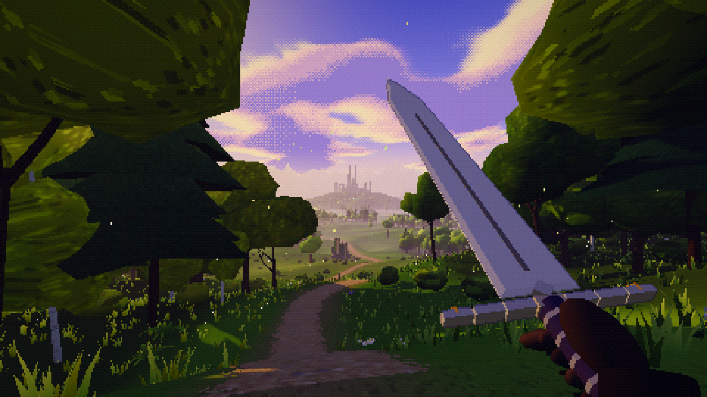

# Hollow Atlas: The Unmapped Kingdoms

A first-person fantasy exploration game for the browser, with a painterly, pixelated look. Every
world grows from a seed. You wake beneath an ancient tree at the edge of a forest. Below you lies a
green vale with a winding road, farms and a hamlet. An enormous Gothic castle rises on the horizon.
Beyond the vale, the world goes on without end and differs for every seed.

**Current state: Milestone 1, plus three later additions:**

- **The open procedural world.** Endless regions with:
  - villages (church, inn, lanterns), farms and cottages;
  - ruined towers, hill keeps and great castles;
  - standing stones, shrines and camps with chests;
  - branching roads with signposts, and places off every road.
- **Exploration tools:** the Hollow Atlas map with fog of war, and a compass.
- **The procedural arsenal and bestiary:** unlimited generated weapons with heavy-tailed luck, plus
  creatures in the developer gallery. See [docs/PROCEDURAL_CONTENT.md](docs/PROCEDURAL_CONTENT.md).

[docs/IMPLEMENTATION_STATUS.md](docs/IMPLEMENTATION_STATUS.md) lists what works and what does not
yet.



## Requirements

- Node.js 20 or newer (developed on Node 22) and npm.
- A browser with **WebGL 2** and hardware acceleration: a current Chrome, Edge, Firefox or Safari on
  desktop, or Safari / Chrome on a recent phone or tablet (touch controls appear automatically).

## Install, run, build

```bash
npm install          # dependencies (Three.js, Vite, TypeScript, Vitest, Playwright)
npm run dev          # dev server at http://localhost:5173
npm run build        # typecheck + production build into dist/
npm run preview      # serve the production build at http://localhost:4173
```

Open the URL, choose **New Journey**, keep or change the seed, then press **Begin**. Journeys are
saved automatically; **Continue Journey** on the title screen picks up where you left off. After the intro,
click **Click to explore** to capture the mouse.

### Playing on a phone or tablet

The game detects a touch screen (no mouse or trackpad) and switches to touch controls and a lighter
quality preset (no shadows, short view distance). Hold the phone sideways.

- **Same Wi-Fi:** run `npm run dev` (it listens on your network), then open
  `http://<your computer's LAN IP>:5173` on the phone.
- **Anywhere:** `npm run build` makes a fully static site in `dist/`; any static host serves it
  (relative paths, no server code). `node scripts/artifact.mjs <dir>` turns the build into a page
  body for hosts that add their own `<html>` skeleton, such as a claude.ai Artifact.
- **Full screen:** Android Chrome goes full screen when you tap *Tap to explore*. On iPhone, use
  Safari's *Share → Add to Home Screen* (from a static host) to launch it full screen without the
  browser bars.

### URL parameters

| Parameter | Effect |
| --- | --- |
| `?seed=reference-valley` | Pre-fills and pre-builds this seed. `reference-valley` is the fixed reference seed used for screenshots. |
| `?autotest` | Test mode: skips the intro and the pointer-lock requirement, and keeps the canvas readable for pixel checks. |
| `?touch` | Force the touch controls (for trying them with a mouse). |
| `?gallery` | **Developer gallery** of procedurally generated creatures and weapons on a stage in the vale (← → to browse without end, R random, Tab to switch, luck slider). |

## Controls

| Input | Action |
| --- | --- |
| W A S D / arrow keys | Move |
| Mouse | Look (after clicking **Click to explore**) |
| Shift | Run |
| Space | Jump |
| Left click | Swing your weapon (there are no enemies yet; combat is Milestone 5) |
| E | Read signposts, examine waystones and shrines, look into wells, **talk to villagers**, **open doors and chests**, **take a weapon** |
| I | Show the card of the weapon in your hand |
| M | Open or close the **Hollow Atlas** (+ / − or the mouse wheel to zoom) |
| Esc | Release the mouse and pause |
| F3 | Debug overlay (FPS, draw calls, streaming, colliders, validation) |

**Touch:**

| Touch | Action |
| --- | --- |
| Thumb down anywhere on the left and slide | Move (a floating stick; push to its edge to run) |
| Drag anywhere else | Look |
| **Swing** / **Jump** | Swing your weapon / jump |
| **Use** (appears when something is in reach), or tap the prompt | Read, examine, talk, open, take a weapon |
| **Weapon** | Show the card of the weapon in your hand |
| **Map** | Open the Hollow Atlas (also in the pause menu) |
| **❚❚** | Pause (Resume returns straight to the game) |

### Exploring

There is no path you have to follow. Some ways to explore:

- Leave the vale by any of its roads.
- Follow a signpost, or strike out across country towards a tower on a hill or smoke above the
  trees.
- Watch the compass. Gold marks are places you have found. A hollow mark means somewhere
  undiscovered is close by.
- Check the Atlas. It inks in only the ground you have travelled near, and lists every place you
  have found.
- Ask the locals. Villagers tell you of real places nearby you haven't found, with the direction
  and how far it is. The Atlas marks each one with a "?" until you get there.
- Inns are open. Step inside, warm up by the hearth, and look upstairs.
- New Journey suggests a random seed every time, so each journey is a different world. Type a seed
  to revisit one, or use `reference-valley` for the reference world.

## Settings

Pixel resolution (180p / 270p / 360p internal), light (morning, afternoon, golden hour, dusk), field
of view, view distance (short / medium / long vegetation range, applied immediately), look
sensitivity (mouse and touch), invert Y, head bob, volume, shadows and ink outlines. Phones and
tablets start with shadows off and a short view distance. Settings are stored
in `localStorage` under `hollow-atlas/settings/v1`.

## Tests

```bash
npm run typecheck    # strict TypeScript
npm test             # Vitest unit tests: determinism, seams, roads, validation, controller
npm run test:e2e     # Playwright browser tests against the production build
npm run screenshots  # capture the reference views into docs/screenshots (dev server must be running)
```

[docs/TESTING.md](docs/TESTING.md) has the details, including the caveat that headless Chromium uses
software WebGL.

## Troubleshooting

- **Black page with a WebGL message:** the browser has no WebGL 2. Enable hardware acceleration or
  try another browser.
- **The mouse does not turn the view:** click **Click to explore**. Browsers only allow pointer lock
  after a click. Esc releases it.
- **Low frame rate:** in Settings, lower the pixel resolution to *Ultra Retro (180p)* and turn
  shadows off. F3 shows triangle and draw-call counts.
- **No sound:** audio starts on the **Begin** click, as browser autoplay rules require. Check the
  volume setting.

## Documentation

| Document | Contents |
| --- | --- |
| [docs/GAME_DESIGN.md](docs/GAME_DESIGN.md) | Core loops, pillars and content rules |
| [docs/ART_DIRECTION.md](docs/ART_DIRECTION.md) | The two references, palettes, renderer targets, screenshot checklist |
| [docs/WORLD_GENERATION.md](docs/WORLD_GENERATION.md) | Seeds, macro terrain, roads, settlements, castle, ecology, validation |
| [docs/ARCHITECTURE.md](docs/ARCHITECTURE.md) | Code layout, systems, frame loop, streaming lifecycle |
| [docs/MILESTONES.md](docs/MILESTONES.md) | The ten milestones and their acceptance gates |
| [docs/IMPLEMENTATION_STATUS.md](docs/IMPLEMENTATION_STATUS.md) | Implemented / prototype / planned, with test results |
| [docs/CONTENT_CATALOG.md](docs/CONTENT_CATALOG.md) | Every asset, site and interaction that actually exists |
| [docs/PROCEDURAL_CONTENT.md](docs/PROCEDURAL_CONTENT.md) | Procedural weapons and creatures, the luck model, the developer gallery |
| [docs/KNOWN_ISSUES.md](docs/KNOWN_ISSUES.md) | Reproducible problems and limitations |
| [docs/TESTING.md](docs/TESTING.md) | How tests, browser runs and visual reviews are done |
| [docs/CHANGELOG.md](docs/CHANGELOG.md) | Changes per milestone |
| [docs/BRIEF.md](docs/BRIEF.md) | The full design brief (sections 0–62) |
| [references/](references) | The two visual reference images |

All geometry, textures and sounds are generated by code. No external art or audio assets are used.
